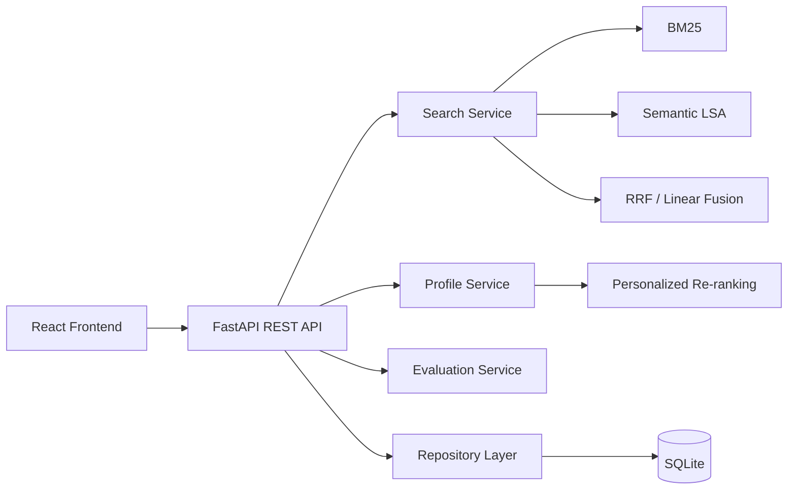

# PSR-SRS Enterprise

一个可在本地完整运行的个性化搜索排序与语义检索推荐系统。

> **Release**: v1.0.0-rc.1  
> **Status**: Release Candidate / Feature Frozen  
> **License**: MIT

## 功能概览

| 模块 | 功能 |
|------|------|
| BM25 | Okapi 关键词相关性检索 |
| Semantic | TF-IDF + SVD/LSA 语义检索 |
| Hybrid | RRF 与 Linear 加权融合排序 |
| Personalization | 基于用户画像的个性化重排 |
| Events | 展示、点击、收藏、购物车、购买行为采集 |
| Evaluation | 检索指标 (P@K, R@K, NDCG, MRR)、候选覆盖率、画像影响评估 |
| Backend | FastAPI + SQLAlchemy 2.x + Alembic + SQLite |
| Frontend | React 19 + TypeScript + Vite |
| Profile | 行为画像构建、base/behavior 合并、批量刷新、确定性重建 |

## 架构



## 环境要求

本项目已在以下环境验证：

- Python 3.12.6
- Node.js 24.16.0
- npm 11.13.0
- Windows 10/11

不需要安装 MySQL、Redis、Kafka 或 Elasticsearch。默认使用 SQLite。

检查你的环境：

```powershell
git --version
python --version
node --version
npm --version
```

## 快速开始

### 1. 克隆仓库

```powershell
git clone <REPOSITORY_URL> PSR-SRS-Enterprise
cd PSR-SRS-Enterprise
```

### 2. 创建虚拟环境

```powershell
python -m venv .venv
```

### 3. 一键初始化

```powershell
.\.venv\Scripts\python.exe .\scripts\bootstrap_local.py
```

此脚本自动完成：依赖安装、数据库迁移、样例数据导入、前端构建。

### 4. 启动系统

```powershell
.\.venv\Scripts\python.exe .\scripts\run_local.py
```

### 5. 打开浏览器

| 服务 | 地址 |
|------|------|
| Frontend | http://127.0.0.1:5173 |
| Backend | http://127.0.0.1:8000 |
| Swagger | http://127.0.0.1:8000/docs |
| OpenAPI | http://127.0.0.1:8000/api/v1/openapi.json |

### 6. 停止系统

```powershell
.\.venv\Scripts\python.exe .\scripts\stop_local.py
```

> **注意**：不要直接关闭运行脚本的终端窗口。请先运行 stop 脚本以正确停止所有子进程。

## 手动安装

如果自动脚本有问题，可以手动执行以下步骤。

### 后端

```powershell
# 安装依赖
cd backend
..\.venv\Scripts\python.exe -m pip install -e ".[dev,ml]"

# 数据库迁移
..\.venv\Scripts\python.exe -m alembic upgrade head
cd ..

# 导入样例数据
.\.venv\Scripts\python.exe .\scripts\import_sample_data.py --source ".\data\sample"
```

### 前端

```powershell
cd frontend
npm ci
npm run build
cd ..
```

### 启动后端

```powershell
cd backend
..\.venv\Scripts\python.exe -m uvicorn app.main:app --host 127.0.0.1 --port 8000
```

### 启动前端（另开终端）

```powershell
cd frontend
npm run dev -- --host 127.0.0.1 --port 5173
```

## 首次使用教程

1. 打开 **Search** 页面 http://127.0.0.1:5173/search
2. 在查询框输入 `electronics`
3. 选择 **BM25** 模式，点击 Search
4. 查看搜索结果（包含标题、分类、品牌、价格、相关性分数）
5. 尝试切换 **Semantic**、**RRF**、**Linear** 模式
6. 勾选 **Personalize**，选择一个 User，再次搜索
7. 观察个性化前后排序的变化
8. 打开 **System** 页面查看 Index 和 Profile 状态
9. 点击搜索结果中的 ☆/Cart/Buy 按钮记录行为事件
10. 打开 **Activity** 页面查看事件统计
11. 在 **User Detail** 页面点击 **Refresh Profile** 刷新行为画像

## 数据说明

本项目使用合成样例数据，不包含真实用户隐私信息。

| 数据集 | 数量 |
|--------|-----|
| Items | 500 |
| Users | 100 |
| Queries | 200 |
| Events | 6,376 |
| Qrels | 10,076 |

事件分布：

| 类型 | 初始数量 |
|------|---------|
| impression | 5,752 |
| click | 529 |
| favorite | 47 |
| add_to_cart | 40 |
| purchase | 8 |

Enterprise 运行不依赖 MVP 项目。

## 测试

### 后端测试

```powershell
cd backend
..\.venv\Scripts\python.exe -m pytest -q
..\.venv\Scripts\python.exe -m ruff check app tests
```

当前结果：**567 passed, 0 failed**

### 前端测试

```powershell
cd frontend
npm run typecheck
npm run lint
npm run test -- --run
npm run build
```

当前结果：**50 passed, 0 failed**

### 发布验证

```powershell
.\.venv\Scripts\python.exe .\scripts\verify_release.py
```

## API 路由

| Method | Path | 说明 |
|--------|------|------|
| POST | `/api/v1/search` | 搜索（BM25/Semantic/RRF/Linear + 个性化） |
| GET | `/api/v1/items` | Item 列表 |
| GET | `/api/v1/items/{id}` | Item 详情 |
| GET | `/api/v1/users` | User 列表 |
| GET | `/api/v1/users/{id}` | User 详情 |
| GET | `/api/v1/users/{id}/profile` | User 画像 |
| POST | `/api/v1/events` | 上报行为事件 |
| GET | `/api/v1/events/stats` | 事件统计 |
| GET | `/api/v1/events/recent` | 最近事件 |
| POST | `/api/v1/evaluation/queries` | 查询评估 |
| POST | `/api/v1/evaluation/candidate-coverage` | 候选覆盖率 |
| POST | `/api/v1/evaluation/profile-impact` | 画像影响评估 |
| POST | `/api/v1/profiles/{id}/refresh` | 刷新单个画像 |
| POST | `/api/v1/profiles/refresh` | 批量刷新画像 |
| GET | `/api/v1/profiles/status` | 画像状态 |
| GET | `/api/v1/system/status` | 系统状态 |
| GET | `/api/v1/system/index` | 索引状态 |
| GET | `/api/v1/system/profiles` | 画像系统状态 |
| GET | `/api/v1/health` | 健康检查 |
| GET | `/api/v1/health/ready` | 就绪检查 |

## 项目结构

```text
PSR-SRS-Enterprise/
├── backend/                  # FastAPI 后端
│   ├── app/                  # 应用代码
│   ├── alembic/              # 数据库迁移
│   ├── tests/                # 后端测试
│   └── pyproject.toml        # Python 依赖
├── frontend/                 # React 前端
│   ├── src/                  # 前端源码
│   └── package.json          # Node 依赖
├── configs/                  # 检索与个性化 JSON 配置
├── data/sample/              # 合成样例数据 (5 CSV + manifest)
├── docs/                     # 架构、审计、发布文档
├── scripts/                  # 初始化、运行、验证脚本
├── artifacts/                # OpenAPI、依赖清单
├── .github/workflows/        # GitHub Actions CI
├── README.md
├── LICENSE
└── RELEASE_CHECKLIST.md
```

## 常见问题

### `python` 命令不存在

安装 Python 3.12，勾选 "Add Python to PATH"。安装后重启终端。

### PowerShell 禁止执行脚本

本项目的命令直接使用 `.venv\Scripts\python.exe` 路径，不需要激活虚拟环境或修改执行策略。

### 端口 8000 或 5173 被占用

使用启动脚本的参数调整端口：

```powershell
.\.venv\Scripts\python.exe .\scripts\run_local.py --backend-port 8001 --frontend-port 5174
```

不要随意终止系统其他进程。

### readiness 返回 503

`/api/v1/health` 代表进程存活。`/api/v1/health/ready` 检查数据库、Schema、索引和画像是否全部就绪。503 表示某项未就绪，查看 System 页面或 readiness 响应获取详情。

### 搜索没有结果

尝试以下查询词（来自真实 sample 数据）：`electronics`, `gaming`, `computer`, `laptop`, `wireless`。

### SQLite 文件被占用

先运行 `stop_local.py` 停止服务，再关闭其他连接该数据库的程序。

### npm install 失败

检查网络连接和 Node.js 版本。优先使用 `npm ci`（需要 `package-lock.json`）。

### 如何重置本地数据库

```powershell
.\.venv\Scripts\python.exe .\scripts\bootstrap_local.py --reset
```

**警告**：这会删除所有本地数据，重新导入合成样例数据。

## 已知限制

- SQLite 数据库适合本地演示和开发，不代表高并发生产部署
- 用户画像存储在内存中，应用重启后从数据库事件确定性重建
- Profile refresh 是同步批量操作
- 不自动监听新增事件
- 不保存历史画像版本
- Profile refresh API 是管理操作，仅适用于受信任本地环境
- 当前版本没有用户认证系统
- 时间衰减未启用（`recency_decay_enabled=false`）

## 许可证

MIT License — 详见 [LICENSE](LICENSE) 文件。
