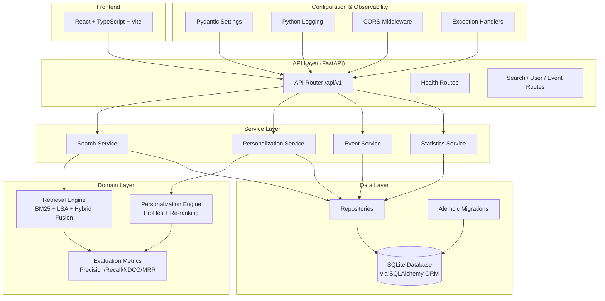

# PSR-SRS Enterprise — Architecture

> **Version**: 0.1.0 (Phase E0)  
> **Status**: Foundation layer complete — health checks, config, DB, logging operational

---

## 1. Design Principles

1. **Lightweight**: No unnecessary infrastructure — SQLite, single-process FastAPI, simple React frontend.
2. **Layered**: Clear separation — API → Service → Repository → DB.
3. **MVP-derived**: Core algorithms (BM25, LSA, fusion, personalization) migrated from proven MVP codebase.
4. **Config-driven**: Environment variables with sensible defaults, no hard-coded paths.
5. **Testable**: Every layer independently testable with fast, local tests.

---

## 2. Architecture Diagram



---

## 3. Layer Descriptions

### 3.1 Frontend Layer (`frontend/`)

| Aspect | Detail |
|--------|--------|
| **Framework** | React 18+ with TypeScript |
| **Build** | Vite |
| **Routing** | React Router v6 |
| **Styling** | Lightweight CSS (no heavy UI framework) |
| **Status** | Placeholder — Phase E5 |

### 3.2 API Layer (`backend/app/api/`)

| Component | File | Status |
|-----------|------|--------|
| Health routes | `routes/health.py` | ✅ Implemented |
| Dependencies | `dependencies.py` | ✅ DB session dependency ready |
| Search routes | (future) | Phase E4 |
| User routes | (future) | Phase E4 |
| Event routes | (future) | Phase E6 |

**URL structure**: `http://127.0.0.1:8000/api/v1/{resource}`

**Error format**:
```json
{
  "error": "not_found",
  "message": "Resource not found"
}
```

### 3.3 Service Layer (`backend/app/services/`)

Orchestrates business logic. Currently empty — will be populated in Phase E3.

### 3.4 Retrieval Layer (`backend/app/retrieval/`)

| Module | Source | Description |
|--------|--------|-------------|
| `tokenization.py` | MVP migration | Deterministic tokenizer + stop-words |
| `bm25.py` | MVP migration | Okapi BM25 index with inverted posting lists |
| `vectorization.py` | MVP migration | TF-IDF + TruncatedSVD pipeline |
| `semantic.py` | MVP migration | LSA cosine-similarity search |
| `fusion.py` | MVP migration | RRF + weighted linear fusion |

**Currently**: Placeholder `__init__.py` files only. Algorithm migration in Phase E1.

### 3.5 Personalization Layer (`backend/app/personalization/`)

| Module | Source | Description |
|--------|--------|-------------|
| `profiles.py` | MVP migration | UserProfile with time-decayed affinity |
| `reranker.py` | MVP migration | Multi-signal personalized re-ranking |
| `split.py` | MVP migration | Time-based train/test split |
| `evaluation.py` | MVP migration | Behavior metrics + coverage analysis |

**Currently**: Placeholder. Migration in Phase E1.

### 3.6 Repository Layer (`backend/app/repositories/`)

Abstracts database access behind clean interfaces. Will bridge SQLAlchemy models to service-layer DTOs. Phase E2.

### 3.7 Database Layer (`backend/app/db/`)

| Component | Detail |
|-----------|--------|
| **ORM** | SQLAlchemy 2.x |
| **Database** | SQLite (default), PostgreSQL-compatible via config |
| **Migrations** | Alembic |
| **Session** | Synchronous `Session` with lazy engine creation |
| **Base** | Declarative `Base` for all models |

### 3.8 Configuration & Logging (`backend/app/core/`)

| Component | Detail |
|-----------|--------|
| **Config** | `pydantic-settings` — reads `.env` + env vars with defaults |
| **Logging** | Python stdlib `logging` with structured format |
| **Exceptions** | `AppError` hierarchy + global FastAPI handlers |
| **CORS** | Configurable origins via `CORS_ORIGINS` env var |

---

## 4. Data Flow

```
User Request → FastAPI Router → Service → Repository → SQLAlchemy → SQLite
                    ↓                          ↓
              Exception Handler         Retrieval/Personalization Engine
                    ↓                          ↓
              JSON Response             Evaluation Metrics
```

### Search Request Flow (future):

```
GET /api/v1/search?q=laptop&user_id=user_001

1. API validates request (Pydantic schema)
2. Service orchestrates:
   a. BM25 retrieval → candidate set A
   b. LSA semantic retrieval → candidate set B
   c. Hybrid fusion (RRF + Linear) → merged ranking
   d. Load user profile from DB
   e. Personalized re-ranking → final ordering
   f. Evaluate against qrels (if available)
3. Repository fetches item details from DB
4. API returns ranked search results as JSON
```

---

## 5. Technology Choices

| Layer | Technology | Rationale |
|-------|-----------|-----------|
| API | FastAPI | Fast, modern, auto-docs, async-capable |
| Config | pydantic-settings | Typed, `.env` support, validation |
| ORM | SQLAlchemy 2.x | Mature, well-documented, DB-agnostic |
| DB | SQLite | Zero-config, file-based, perfect for local dev |
| Migrations | Alembic | Standard for SQLAlchemy |
| Tests | pytest + httpx | Fast, expressive, well-supported |
| Lint | ruff | Fast, comprehensive, all-in-one |
| Types | mypy | Static type checking |

### Intentionally NOT included (Phase E0):

- Redis, Kafka, Flink, Kubernetes
- Elasticsearch, OpenSearch
- Celery, Celery Beat
- Microservice decomposition
- Cloud provider SDKs
- Docker production images

---

## 6. Directory Structure (Current)

```
PSR-SRS-Enterprise/
├── .venv/                     # Virtual environment (not committed)
├── backend/
│   ├── app/
│   │   ├── api/               # FastAPI routes + dependencies
│   │   ├── core/              # Config, logging, exceptions
│   │   ├── db/                # SQLAlchemy engine, session, init
│   │   ├── models/            # ORM models (placeholder)
│   │   ├── schemas/           # Pydantic schemas (placeholder)
│   │   ├── repositories/      # Data access (placeholder)
│   │   ├── services/          # Business logic (placeholder)
│   │   ├── retrieval/         # BM25/LSA/fusion (placeholder)
│   │   ├── personalization/   # Profiles/reranking (placeholder)
│   │   ├── evaluation/        # IR metrics (placeholder)
│   │   └── main.py            # App factory + entry point
│   ├── alembic/               # DB migrations
│   ├── tests/                 # Test suite (25 tests)
│   └── pyproject.toml         # Backend dependencies
├── configs/                   # Algorithm configs (JSON)
├── data/                      # Datasets + SQLite DB
├── docs/                      # Architecture, audit, plan
├── frontend/                  # React app (placeholder)
├── scripts/                   # CLI utilities (placeholder)
├── outputs/                   # Generated outputs
├── .env.example               # Environment template
├── .gitignore
├── README.md
└── docker-compose.yml         # Placeholder compose
```

---

## 7. Future Extension Points

1. **PostgreSQL**: Change `DATABASE_URL` — no code changes needed (SQLAlchemy abstraction).
2. **Redis caching**: Add Redis client to service layer for session/profile caching.
3. **OpenSearch**: Replace BM25 with OpenSearch queries for production-scale full-text search.
4. **Async workers**: Add Celery for background tasks (profile updates, evaluation runs).
5. **Real A/B testing**: Feature flags + metrics collection pipeline.

None of these are required for the current lightweight version.
